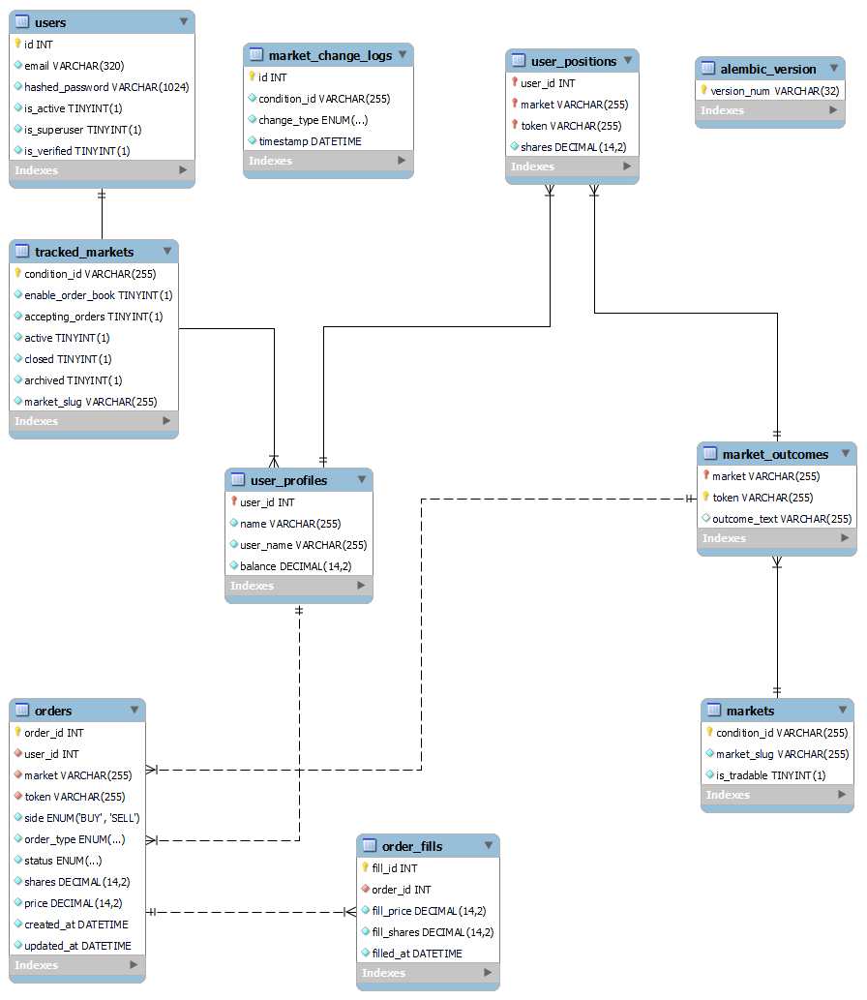

# Polymarket-Mock Backend

A mock trading backend for Polymarket, allowing users to simulate trades, manage markets, and experiment with automated trading strategies.

## Quick Start

### 1. **Clone the Repo**
```bash
git clone
https://github.com/navin-prasath-s/polymarket-paper-trading
cd polymarket-mock
```

### 2. **Setup Environment**
```bash
python -m venv .venv
source .venv/bin/activate  # On Windows: .venv\Scripts\activate
pip install -r requirements.txt

Create a MySQL database and update the environment variables accordingly.
```

### 3. **Configure Environment Variables**
```bash
DB_USER=your_mysql_db_user
DB_PASSWORD=your_mysql_db_password
DB_HOST=localhost
DB_PORT=3306
DB_NAME=your_db_name
JWT_SECRET=your_jwt_secret
API_BASE_URL=http://localhost:8080  # or your production URL
``` 

### 4. **Run Migrations**
```bash
alembic upgrade head
```

### 5. **Start the Server**
```bash
uvicorn app.app:app --reload

# Access the API at http://localhost:8080
# Access the Swagger UI at http://localhost:8080/docs
```


# Contributing
PRs, issues, and feature requests welcome!


# License
This project is licensed under the MIT License - see the [LICENSE](LICENSE) file for details.


## Database Schema

